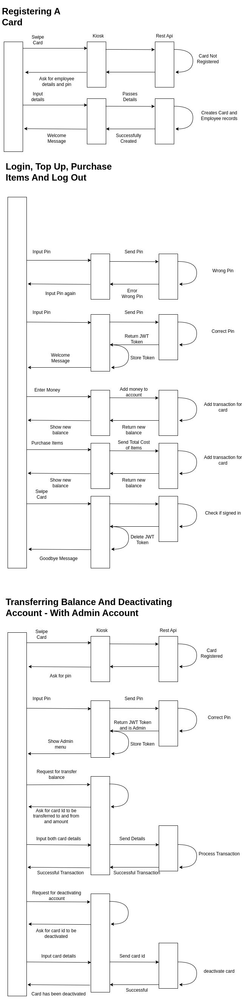

# Ada-Membership-Api

## Requirements

|Requirementes                          | User      |
|---                                    |---        |
|Register card                          | Employee  |
|Login                                  | Employee  |
|Log out                                | Employee  |
|Top up account                         | Employee  |
|Purchase items                         | Employee  |
|Add pin                                | Employee  |
|See Balance                            | Employee  |
|Sign Out                               | Employee  |
|Register Admin Account                 | Admin     |
|Transfer Balance to another account    | Admin     |
|Deactivate Account                     | Admin     |

The admin requirements are things I believe the API should be able to do eventually however I am not making them part of this MVP.
## Assumptions

- An employee can multiple cards. For example if they lose their card they can request a new card and have their balance  transferred and have their old card deactivated. The transfer of balance and card deactivation would be done by an admin.

- The card already has a unique id on the card before registering.
- You can top up money on the kiosk with cash.
- As there is a PIN I assumed that after swiping the card the Kiosk will ask for the PIN which the user can then sign in with. This is a change in requirement as it means it no longer shows a welcome message until the employee has inputted their PIN. I did this because the welcome message contains sensitive information such as name.
- The Kiosk can perform basic tasks such as deleting a token and sending a token in the header when making a request. 
- It will be able to read the status and message of the response and be display a corresponding output to the user.

## UML - Diagrams

The first two diagrams contain what an employee can do and an admin may potentially be able to do.

## ERD
